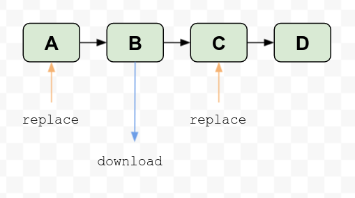

# Replaces Examples

This project shows different cases where you have dependencies among different data sources with materializations and you need to replace some data.

It is important to note that at the time of writing the replacement process has the following limitations:
1. The replacement process is atomic and dependent views are updated but just the first level. This means that if you have more than one level of dependency just the first one will be updated. 

1. We do not support replaces where several pipes materialize data into the same data source. If you have this use case you will find just one of the pipes is executed. The truth is that all of them are executed but just the latest one is stored.

1. In the case of doing a selective replacement, the replacement is done by partitions. All the partition is recomputed even if you want to change just one row. Thus, **the partition field must be part of the replacement condition**.

1. All the data sources involved must share the partition key.

1. The update process is atomic, however, we are not able to handle incoming changes during the process so if you append data during the replacement process this new data will be discarded.


In the following sections, you'll find several examples of how to do replacements to maintain all your data consistent.

## 1-level dependencies

The most common use case for a replacement is:


In this case, you can create the resources and load data: 

```sh
tb push pipes/mv_ds_a_b.pipe --push-deps
tb datasource append ds_a datasources/fixtures/a.csv
```

This will load the data in ds_a and it will be automatically populated to `ds_b`.

Now, we want to replace some data. Let's do it and check how it is automatically done in the dependent-view `ds_b`.

Our data source `ds_a` has two columns where both columns have the same data except `a1=1`. This row is wrong, we can update this record and it will be automatically updated in `ds_b`.

```sh
tb datasource replace ds_a --sql-condition="a1=1" datasources/fixtures/a_replacement.csv
```

You can now check how it has been fixed in both data sources.

## N-level dependencies

As we mentioned before, when you do a replacement just the first level dependency will be automatically updated.


If we push the new resources and load the data we can check how data is properly populated in all the data sources.

```sh
tb push pipes/mv_ds_b_c.pipe --push-deps
tb push pipes/mv_ds_c_d.pipe --push-deps
tb datasource truncate ds_a
tb datasource truncate ds_b
tb datasource append ds_a datasources/fixtures/a.csv
```

However, we have the same problem we had before. One of the rows `a1=1` is wrong and we need to fix it.

```sh
tb datasource replace ds_a --sql-condition="a1=1" datasources/fixtures/a_replacement.csv
```

If you check your data sources you can verify just `ds_a` and `ds_b` contains the new data. What can we do with the other data sources??

You can use different strategies. Our recommendation is to use the materialization pipes to export data and do a replacement in the next node. In our example, we have four data sources `ds_a`, `ds_b`, `ds_c`, and `ds_d`. The first two ones are already fixed. Then we need to fix C and D: 
1. Clone the materialization pipe `mv_ds_b_c`.
1. Expose the latest node as an endpoint. It will export data already fixed.
1. Load the data into `ds_c` doing a replacement. It will update the data into `ds_c`and `ds_d`.

```sh
tb push endpoints/mv_ds_b_c_export.pipe

curl -H "Authorization: Bearer $TOKEN" -d "select * from mv_ds_b_c_export where a1=1 format CSVWithNames" "https://api.tinybird.co/v0/sql" > datasources/fixtures/updates.csv

tb datasource replace ds_c --sql-condition="a1=1" datasources/fixtures/updates.csv
```

Now you can check how `ds_c` and `ds_d` have been properly updated.

We have exported data using the query endpoint but you can use parameters and define your own pipe as you prefer.

## Multiple views writing in the same data source

We do not support replaces with this use case.


```sh
tb push pipes/mv_ds_a1_aa.pipe --push-deps
tb push pipes/mv_ds_a2_aa.pipe --push-deps
tb push pipes/mv_ds_a3_aa.pipe --push-deps

tb datasource truncate ds_a
tb datasource append ds_a datasources/fixtures/a.csv
```

In order to replace data, you need to execute each of the materializations as we did in the previous example and replace data selectively. In this case, you need to add in the filter the condition for each table. In the example the `type` column.

If we check what we have in `ds_dd` now have:


We have three entries with column a1=1, one per materialization type a1, a2, and a3.

We need to fix the data because columns a1 and a2 must have the same values and you can see how a1 and a2 do not match when a1=1.

The first step is to update the source of data:

```sh
tb datasource replace ds_a --sql-condition="a1=1" datasources/fixtures/a_replacement.csv
```

Now you can check how your source data `ds_a` contains the right data. However, your destination `ds_aa` shows unexpected results:


We only have one row with a1=1. This is because all the materializations have been executed but just the last one is stored, the previous ones are overwritten. Thus, we need to export the data from our materialization pipes and replace the data right in the destination data source.

```sh
tb push pipes/mv_ds_a1_aa_export.pipe

curl -H "Authorization: Bearer $TOKEN" -d "select * from mv_ds_a1_aa_export where a1=1 format CSVWithNames" "https://api.tinybird.co/v0/sql" > datasources/fixtures/a1_updates.csv

tb datasource replace ds_aa --sql-condition="a1=1 and type = 'a1'" datasources/fixtures/a1_updates.csv 

tb push pipes/mv_ds_a2_aa_export.pipe

curl -H "Authorization: Bearer $TOKEN" -d "select * from mv_ds_a2_aa_export where a1=1 format CSVWithNames" "https://api.tinybird.co/v0/sql" > datasources/fixtures/a2_updates.csv

tb datasource replace ds_aa --sql-condition="a1=1 and type = 'a2'" datasources/fixtures/a2_updates.csv 

tb push pipes/mv_ds_a3_aa_export.pipe

curl -H "Authorization: Bearer $TOKEN" -d "select * from mv_ds_a3_aa_export where a1=1 format CSVWithNames" "https://api.tinybird.co/v0/sql" > datasources/fixtures/a3_updates.csv

tb datasource replace ds_aa --sql-condition="a1=1 and type = 'a3'" datasources/fixtures/a3_updates.csv 

```

Now, you can check how your data is consistent.

## Replacement Process

In general, our recommendation is to reduce the depth level if not necessary. If you can't, here are some instructions to make it easier for you.

In order to execute a replacement for some data, you need to have very clear your dependency path. You can get this information in the Tinybird UI, Data Flow, or by selecting one of the data sources from the Advanced Options tab.

Once you have your data flow you need to know that your view dependencies will be updated just for the next level where you do the replacement. If you have more than 2 deep levels you will need to do the replacement more than one time.



In the previous example, you have four data sources in your data flow so you need to do a replace on A and also in C. Remember that you need to extract data from your materialization pipe from B, as you did in [N-level dependencies section](#n-level-dependencies).

### Automation process

The whole process can be automated in static or dynamic ways.

Statically you can get your data flow to analyze the dependencies and check where you need to do the replacements and exports to automatize the whole replacement process.

The problem with the static solution is that you have to manually adapt the solution each time your data flow changes.

Another option is doing it dynamically. Our API endpoints provide all the required information to dynamically build a dependency graph where you can automatically apply the rules to execute a replacement with success.

In the following code snippet, you have the response of our pipe API.

```sh
curl --request GET 'https://ui.tinybird.co/v0/pipes/t_486f224f533342589b31cc1476dd8e48' \
--header 'Authorization: Bearer <TOKEN>'
```

For each node, you get the list of dependencies. They can be data sources or other nodes. You can combine this response with the list of data sources using the data source API to build your dependency graph.

```json

{
  "id": "t_1b501ccf34764a69aaf886bac9a7a6d8",
  "name": "events_per_day",
  "published_version": "t_5164622050b244338ea2b79c19bd1e57",
  "published_date": "2019-06-14 10:17:01.201962",
  "nodes": [
    {
      "name": "events_per_day_0",
      "sql": "select * from app_events",
      "id": "t_878a81f0e1344a2ca990c8c1aa7dd69f",
      "dependencies": [
        "app_events"
      ],
      "materialized": false,
      "created_at": "2019-06-14 10:17:01.201784"
    },
    {
      "name": "events_per_day_1",
      "sql": "select toDate(date) date, count() event_count from events_per_day_0 group by date",
      "id": "t_5164622050b244338ea2b79c19bd1e57",
      "dependencies": [
        "events_per_day_0"
      ],
      "materialized": false,
      "created_at": "2019-06-14 10:17:01.201943"
    }
  ]
}
```

You can list your pipes:

```sh
curl --request GET 'https://ui.tinybird.co/v0/pipes' \
--header 'Authorization: Bearer <TOKEN>'
``` 

And get list of your data sources:

```sh
curl --request GET 'https://ui.tinybird.co/v0/datasources' \
--header 'Authorization: Bearer <TOKEN>'
```

You have detailed information about the [datasource APIs](https://docs.tinybird.co/api-reference/datasource-api.html) and [pipe API](https://docs.tinybird.co/api-reference/pipe-api.html).
